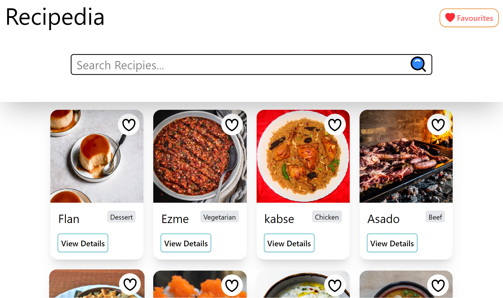
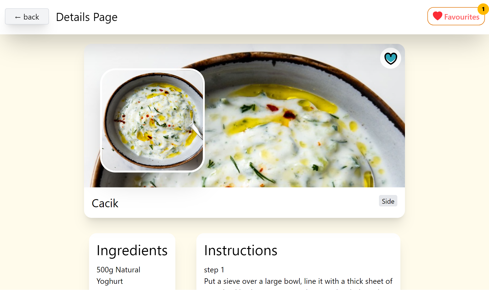
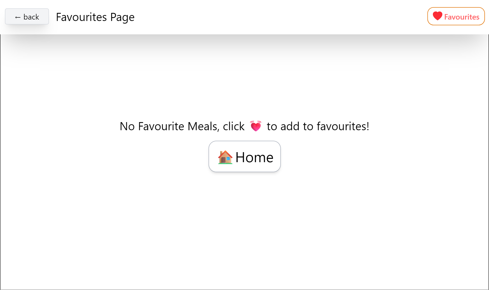
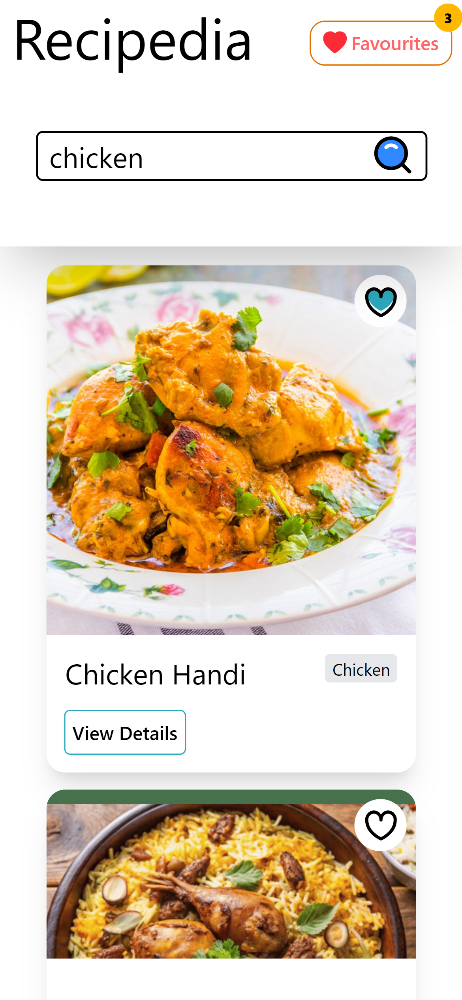
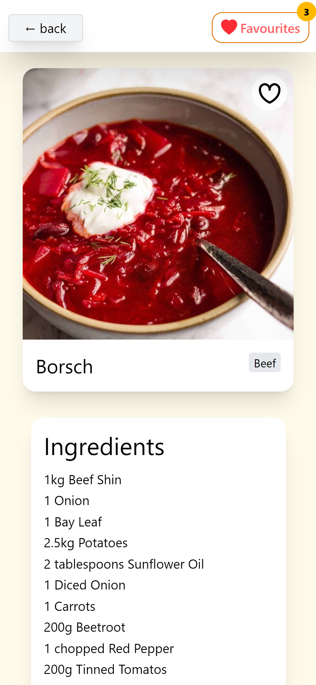

# 🍽️ Recipedia - Recipe Finder App

[](https://recipedia-five.vercel.app/)
[](https://reactjs.org/)
[](https://tailwindcss.com/)
[](https://vitejs.dev/)

**🔗 Live Demo:** [https://recipedia-five.vercel.app/](https://recipedia-five.vercel.app/)

---

## 📌 Overview

Recipedia is a modern recipe discovery application that allows users to search for meals, view detailed cooking instructions, and manage their favorite recipes. The app integrates with **TheMealDB API** and provides a seamless user experience with responsive design and persistent favorites storage.

---

## 🛠️ Tech Stack

| Category        | Technologies                                                  |
| --------------- | ------------------------------------------------------------- |
| **Frontend**    | ⚛️ React · 🧭 React Router · 🔄 Context API · 🎨 Tailwind CSS |
| **API & Data**  | 🔌 Axios · 🍽️ TheMealDB API                                   |
| **Build Tools** | ⚡ Vite                                                       |
| **Storage**     | 💾 LocalStorage                                               |

---

## 📱 Screenshots

### Desktop Views

| Home Page                          | Details Page                             | Favorites Page                               |
| ---------------------------------- | ---------------------------------------- | -------------------------------------------- |
|  |  |  |

### Mobile Views

| Mobile Home                                              | Mobile Details                                              |
| -------------------------------------------------------- | ----------------------------------------------------------- |
|  |  |

---

## ✨ Features

### 🔍 Recipe Search

- Search for recipes using keywords
- Real-time API integration with TheMealDB
- Loading indicators during API calls
- "No results found" state for empty searches
- Responsive grid layout for results

### 📖 Recipe Details Page

- High-quality recipe images
- Recipe name and category
- Complete ingredients list with measurements
- Step-by-step cooking instructions

### ❤️ Favorites Management

- Add/remove recipes to/from favorites
- Visual feedback with filled/outlined heart icons
- Favorites stored in **localStorage** for persistence
- Dedicated Favorites page to view all saved recipes
- Remove recipes directly from favorites page

### 📱 Fully Responsive Design

- **Mobile:** Single column layout
- **Tablet:** 2-column grid
- **Desktop:** 3-4 column grid based on screen size

---

## 📁 Project Structure

```
src/
├── assets/
│ ├── jpg/
│ │ └── NoResultsFound.jpg
│ └── svg/
│ ├── favourite-filled.svg
│ ├── favourite-outline.svg
│ ├── heart.svg
│ └── search.svg
│
├── components/
│ ├── BodyComponent.jsx
│ ├── DefaultHeader.jsx
│ ├── FavouritesButton.jsx
│ ├── HeaderHome.jsx
│ ├── loadingIndicator.jsx
│ └── MealCard.jsx
│
├── constants/
│ ├── Flags.constats.js
│ ├── localStorage.constants.js
│ └── Routes.jsx
│
├── context/
│ ├── FavouriteContext.jsx
│ └── FavouriteProvider.jsx
│
├── pages/
│ ├── HomePage.jsx
│ ├── DetailsPage.jsx
│ └── FavouritesPage.jsx
│
├── services/
│ ├── api.js
│ └── mealServices.js
│
├── util/
│ └── createIngredientsUtil.js
│
├── App.jsx
├── main.jsx
└── index.css
```

## 📄 License

This project was created as part of a coding assignment for educational purposes.

## 🚀 Getting Started

### Prerequisites

- Node.js (v14 or higher)
- npm or yarn

### Installation

1. **Clone the repository**
   ```bash
   git clone https://github.com/Hishamkool/Recipedia.git
   cd Recipedia
   ```

Built with ❤️ by Hisham
